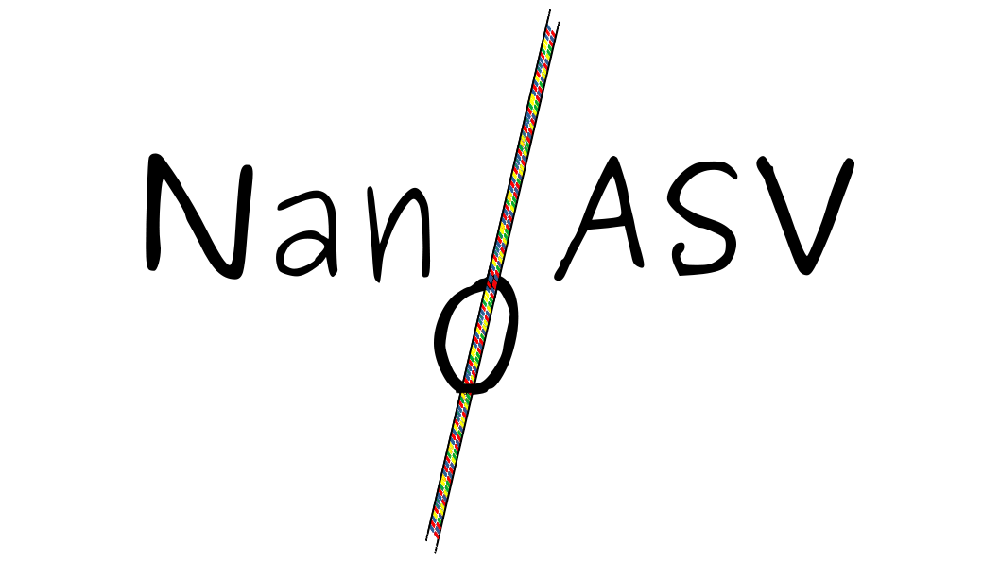

# NanoASV
NanoASV is a docker based Nanopore 1500bp 16S Metabarcoding amplicon data analysis workflow. 

# Installation
## EASY - Download for Singularity
Just download and uncompress the archive then run with singularity accordingly
```sh
wget path/to/archive
tar -xvzf nanoasv.tar.gz 
sudo mv nanoasv /opt/
echo 'export PATH=$PATH:/opt/' >> ~/.bashrc && source ~/.bashrc

```
Then test if everything is working properly
```sh
nanoasv -d Minimal -o out_minimal_test [--options]
```

## ADVANCED - Build from source with Docker
Takes 75 min on my computer (32Gb RAM - 12 cores).
The longest part is SILVA indexing step.
Avoid this step by downloading the (heavy) NanoASV.tar archive
```sh
git clone https://github.com/ImagoXV/NanoASV
docker build -t nanoasv NanoASV/.
```
### Create Docker archive to build with Singularity

```sh
docker save NanoASV.tar nanoasv
```
## ADVANCED - Build image with Singularity
I recommend building the sif file from the docker archive 
```sh
singularity build nanoasv docker-archive://NanoASV.tar
```

## ADVANCED - Install on MK1C sequencing device

All previous steps can be used to install on MK1C, but be sure to use the aarch64 version. **IT WILL NOT RUN IF IT'S NOT AARCH64 VERSION**

# Usage
## RECOMMENDED - With Singularity
If added to the path

```sh
nanoasv -d path/to/sequences -o out [--options]
```
Or 
```sh
singularity run nanoasv -d path/to/sequences -o out [--options]
```
Or if installed elsewhere 
```
/path/to/installation/nanoasv -d path/to/sequences -o out [--options] 
```
## ADVANCED - With Docker
I highly recommand you not to run it with docker because of root privileges.
Don't forget the --docker flag
```sh
docker run -v $(pwd)/Minimal:/data/Minimal -it nanoasv -d /data/Minimal -o out --docker
```
You can mount your sequences directory anywhere in the container, but I recommand you to mount in /data/

## Technical recommandations
If running on a PC, I suggest to not use more than two threads with 32Gb of RAM. Otherwise, you might crash your system. 
I highly suggest you to run it on a cluster. 
96 samples (--subsampling 50000) run perfectly fine with 150Gb and 8 threads

## Options

```
| Option               | Description                                                                    |
| -------------------- | ------------------------------------------------------------------------------ |
| `-h`, `--help`       | Show help message                                                              |
| `-v`, `--version`    | Show version information                                                       |
| `-d`, `--dir`        | Path to fastq_pass/                                                            |
| `-q`, `--quality`    | Quality threshold for Chopper, default: 8                                      |
| `-l`, `--minlength`  | Minimum amplicon length for Chopper, default: 1300                             |
| `-L`, `--maxlength`  | Maximum amplicon length for Chopper, default: 1700                             |
| `-i`, `--id-vsearch` | Identity threshold for vsearch unknown sequences clustering step, default: 0.7 |
| `-p`, `--num-process`| Number of cores for parallelization, default: 1                                |
| `--subsampling`      | Max number of sequences per barcode, default: 50,000                           |
| `--no-r-cleaning`    | Flag - to keep Eukaryota, Chloroplast, and Mitochondria sequences              |
|                      | from phyloseq object                                                           |
| `--metadata`         | Specify metadata.csv file directory, default is demultiplexed directory (--dir)|
| `--notree`           | Flag - To remove phylogeny step and subsequent tree from phyloseq object       |
| `--docker`           | Flag - To run NanoASV with Docker                                              |
| `--ronly`            | Flag - To run only the R phyloseq step                                         |
```

# How it works 

## Building from source

Building from source is pretty long at the moment.
The main time bottle neck is bwa SILVA138.1 indexing step (~60min on 32Gb RAM PC)
It is way faster if you download the archive and build with Singularity. However, the archive is pretty heavy. 

## Data preparation
Directly input your /path/to/sequence/data/fastq_pass directory 
4000 sequences fastq.gz files are concatenated by barcode identity to make one barcodeXX.fastq.gz file.

## Filtering
Chopper will filter for inappropriate sequences.
Is executed in parrallel (default --num-process = 1 )
Default parameters will filter for sequences with quality>8 1300bp<length<1700bp

## Chimera detection
<!-- Chimera detection is performed with vsearch --uchime_denovo.
Is executed in parrallel (default --num-process = 6 ) -->
There is no efficient chimera detection step at the moment

## Adapter trimming
Porechop will trimm known adapters 
Is executed in parrallel (default --num-process = 1 )

## Subsampling
50 000 sequences per barcode is enough for most common questions.
Default is set to 2.5 millions sequences per barcode. 
Can be modified with --subsampling int

## Alignment
bwa-mem2 will align previously filtered sequences against SILVA 138.1
Is executed in parrallel (default --num-process = 1 )
In the future, I will add the possibility to use another database than SILVA
barcode*_abundance.tsv, Taxonomy_barcode*.csv and barcode*_exact_affiliations.tsv like files are produced.
Those files can be found in Resumlts directory.

## Unknown sequences clustering
Non matching sequences fastq are extracted then clustered with vsearch (default --id 0.7).
Clusters with abundance under 5 are discarded to avoid useless heavy computing.
Outputs into Results/Unknown_clusters

## Phylogenetic tree generation
Reference ASV sequence from SILVA138.1 are extracted accordingly to detected references. 
Unknown OTUs seed sequence are added. The final file is fed to FastTree to produce a tree file
Tree file is then implemented into the final phyloseq object.
This allows for phylogeny of unknown OTUs and 16S based phylogeny taxonomical estimation of the entity.

## Phylosequization
Alignements results, taxonomy, clustered unknown entities and 16S based phylogeny tree are used to produce a phyloseq opbject: NanoASV.rdata
Please refer to the metadata.csv file in Minimal dataset to be sure to input the correct file format for phyloseq to produce a correct phyloseq object.
In the future, I will add a possibility to just start from output results if metadata.csv is bad format
You can choose not to remove Eukaryota, Chloroplasta and Mitochondria sequences (pruned by default) using --r_cleaning 0
### --ronly option
Sometimes, your metadata.csv file will not meet phyloseq standards. 
To avoid you recomputing all the previous steps, a --ronly option can be added. 
Just precise --dir and --out as in your first treatment. NanoASV will find final datasets and run only the r script. 
This will save you time.

## Citation
Please don't forget to cite NanoASV and dependencies if it helped you treat your Nanopore data
Thank you !


