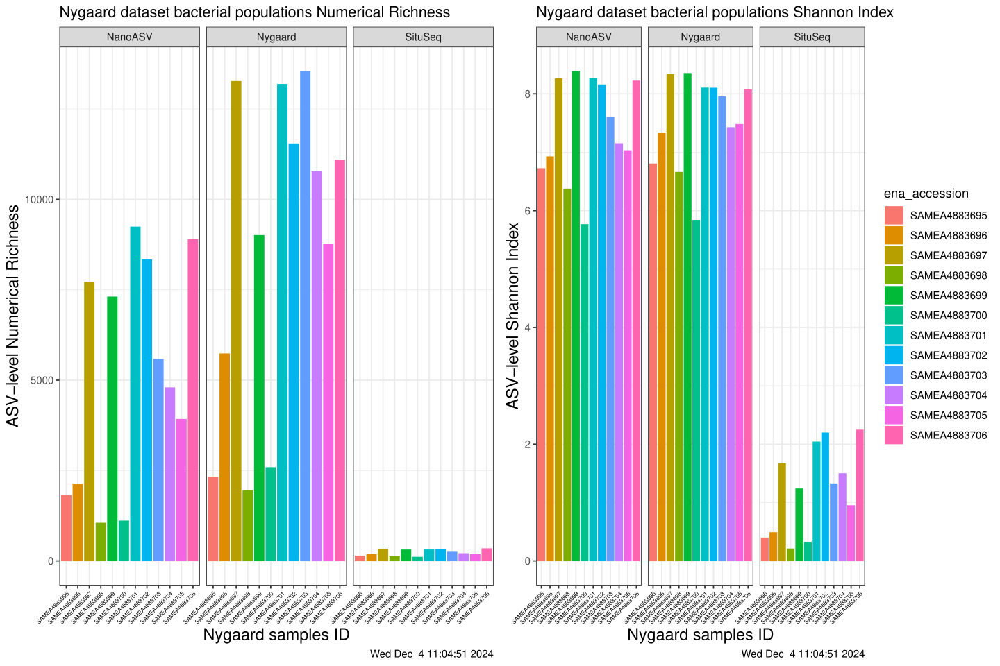
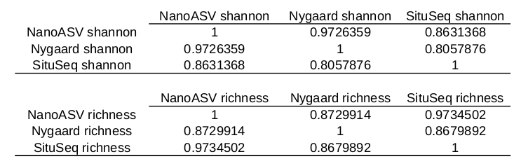
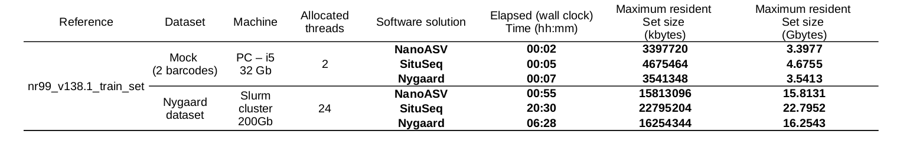

# NanoASV

NanoASV is a conda environment snakemake based workflow using state of
the art bioinformatic softwares to process full-length SSU rRNA
(16S/18S) amplicons acquired with Oxford Nanopore Sequencing
technology. Its strength lies in reproducibility, portability and the
possibility to run offline. It can be installed on the Nanopore MK1C
sequencing device and process data locally.

## Options

Usage: `nanoasv -d path/to/dir -o path/to/output [--options]`

```
| Option               | Description                                                          |
| -------------------- | ---------------------------------------------------------------------|
| `-h`, `--help`       | Show help message                                                    |
| `-v`, `--version`    | Show version information                                             |
| `-d`, `--dir`        | Path to demultiplexed barcodes                                       |           
| `-o`, `--out`        | Path for output directory                                            |
| `-db`, `--database`  | Path to reference fasta file                                         |
| `-q`, `--quality`    | Quality threshold for Chopper, default: 8                            |
| `-l`, `--minlength`  | Minimum amplicon length for Chopper, default: 1300                   |
| `-L`, `--maxlength`  | Maximum amplicon length for Chopper, default: 1700                   |
| `-i`, `--id-vsearch` | Identity threshold for vsearch clustering step, default: 0.7         |
| `-ab`, `--minab`     | Minimum unknown cluster total abundance to be kept                   |
| `-p`, `--num-process`| Number of cores for parallelization, default: 1                      |
| `--subsampling`      | Max number of sequences per barcode, default: 50,000                 |
| `--no-r-cleaning`    | Flag - to keep Eukaryota, Chloroplast, and Mitochondria sequences    |
|                      | from phyloseq object                                                 |
| `--metadata`         | Specify metadata.csv file directory, default is --dir                |
| `--notree`           | Flag - To remove phylogeny step and tree from phyloseq object        |
| `--sam-qual`         | To tune samtools filtering quality threshold, default: 30            |
| `--requirements`     | Flag - To display personal reference fasta requirements              |
| `--dry-run`          | Flag - NanoASV Snakemake dry run                                     |
| `--mock`             | Flag - Run mock dataset with NanoASV                                 |
| `--remove-tmp`       | Remove tmp data after execution. No snakemake resume option if set.  |
```


# Installation with Conda

(to install NanoASV on Oxford Nanopore MK1C sequencing devices, see
section [ONT MK1C Installation](#ont-mk1c-installation))

Clone the repository from [github](https://github.com/ImagoXV/NanoASV.git):

```sh
cd ${HOME}
git clone https://github.com/ImagoXV/NanoASV.git
```

Run the installation script:

```sh
bash ${HOME}/NanoASV/config/install.sh
```

Then activate the environment:

```sh
conda activate NanoASV
```

Don't forget to activate the environment before running `nanoasv`. It
will not work otherwise.

## Database setup

NanoASV can be used with any reference fasta file. If you want to have
a broad idea of your community taxonomy, we recommend you to use
latest [Silva](https://www.arb-silva.de/).

Download the database and put it in `./resources/`:

```sh
RELEASE=138.2
URL="https://www.arb-silva.de/fileadmin/silva_databases/release_${RELEASE}/Exports"
INPUT="SILVA_${RELEASE}_SSURef_NR99_tax_silva.fasta.gz"
OUTPUT="SINGLELINE_${INPUT/_NR99/}"
FOLDER="${HOME}/NanoASV/resources"

mkdir -p "${FOLDER}"

echo "downloading and formating SILVA reference, this will take a few minutes."
wget --output-document - "${URL}/${INPUT}" | \
    gunzip --stdout | \
    awk '/^>/ {printf("%s%s\n", (NR == 1) ? "" : RS, $0) ; next} {printf("%s", $0)} END {printf("\n")}' | \
    gzip > "${FOLDER}/${OUTPUT}"

unset RELEASE URL INPUT OUTPUT
```

## Test your installation

### With a dry run

```sh
nanoasv --dry-run
```

### With mock dataset

```sh
nanoasv --mock
```

You can inspect NanoASV's output structure in `./Mock_run_OUPUT/`.


# ONT MK1C Installation

You need to use the [aarch64-MK1C](https://github.com/ImagoXV/NanoASV/tree/aarch64-MK1C-conda) branch, **otherwise, it will not work.**

You first need to install
[miniconda](https://docs.anaconda.com/miniconda/). Note that `/data/`
will be used for installation for storage capacity matters.

```sh
mkdir -p /data/miniconda3
wget https://repo.anaconda.com/miniconda/Miniconda3-latest-Linux-aarch64.sh -O /data/miniconda3/miniconda.sh --no-check-certificate
bash /data/miniconda3/miniconda.sh -b -u -p /data/miniconda3
rm /data/miniconda3/miniconda.sh
source /data/miniconda3/bin/activate
```

Then proceed to install `conda`.

Chopper needs to be Aarch64 compiled. Therefore, you need to download
this specific archive or a newer one if someone cross-compiles it.

Warning, don't setup NanoASV environment from the `conda (base)`
environment. Otherwise you'll run into issues.

```sh
cd /data/
git clone \
    --branch aarch64-MK1C-conda \
    --single-branch https://github.com/ImagoXV/NanoASV.git
cd ./NanoASV/
conda deactivate
conda env create -f environment.yml
(
    cd ./config/
    wget https://github.com/wdecoster/chopper/releases/download/v0.7.0/chopper-aarch64.zip
    unzip chopper-aarch64.zip
)
ROOT_DIR="$(conda env list | grep -w 'NanoASV' | awk '{print $2}')"
ACTIVATE_DIR="${ROOT_DIR}/etc/conda/activate.d"
cp ./config/{alias,paths}.sh ${ACTIVATE_DIR}/
echo "export NANOASV_PATH=$(pwd)" >> ${ACTIVATE_DIR}/paths.sh
DEACTIVATE_DIR="${ROOT_DIR}/etc/conda/deactivate.d"
cp ./config/unalias.sh ${DEACTIVATE_DIR}/
chmod +x ./workflow/run.sh
```

## Database setup

NanoASV can be used with any reference fasta file. If you want to have
a broad idea of your community taxonomy, we recommend you to use
latest [Silva](https://www.arb-silva.de/).

Download the database and put it in `./resources/`:

```sh
RELEASE=138.2
URL="https://www.arb-silva.de/fileadmin/silva_databases/release_${RELEASE}/Exports"
INPUT="SILVA_${RELEASE}_SSURef_NR99_tax_silva.fasta.gz"
OUTPUT="SINGLELINE_${INPUT/_NR99/}"
FOLDER="resources"

mkdir -p "${FOLDER}"

echo "downloading and formating SILVA reference, this will take a few minutes."
wget --output-document - "${URL}/${INPUT}" | \
    gunzip --stdout | \
    awk '/^>/ {printf("%s%s\n", (NR == 1) ? "" : RS, $0) ; next} {printf("%s", $0)} END {printf("\n")}' | \
    gzip > "./${FOLDER}/${OUTPUT}"

unset RELEASE URL INPUT OUTPUT
```

## R environment installation

```sh
conda create -y --name R-phyloseq -c bioconda -c conda-forge bioconductor-phyloseq
conda activate R-phyloseq
Rscript -e 'install.packages("dplyr", repos = "https://cran.r-project.org")'
conda deactivate
```

## Test run on MK1C device

```sh
conda activate NanoASV
nanoasv --mock
```

<!--
## Cluster execution

The workflow can be executed on a cluster using snakemake cluster configuration. Install a [profile](https://github.com/Snakemake-Profiles) for your cluster's job submission system. Edit the defaults in the file `cluster.json` and run the workflow. For example:

```sh
snakemake \
    -p \
    --jobs 100 \
    --profile slurm \
    --cluster-config cluster.json \
    -s workflow/snakefile \
    --configfile config/config.yaml
```
-->

# How NanoASV works


## Data preparation

Directly input your `/path/to/sequence/data/fastq_pass` directory
4000 sequences `fastq.gz` files are concatenated by barcode identity to make one `barcodeXX.fastq.gz` file.

## Filtering

Chopper will filter for inappropriate sequences.
Is executed in parallel (default `--num-process 1`)
Default parameters will filter for sequences with quality > 8 and 1300bp < length < 1700bp

## Chimera detection

<!-- Chimera detection is performed with vsearch --uchime_denovo.
Is executed in parallel (default --num-process = 6 ) -->
There is no efficient chimera detection step at the moment.

## Adapter trimming

Porechop will trim known adapters
Is executed in parallel (default `--num-process 1`)

## Subsampling

50 000 sequences per barcode is enough for most common questions.
Default is set to 50 000 sequences per barcode.
Can be modified with `--subsampling int`

## Alignment

`minimap2` will align previously filtered sequences against the reference dataset (SILVA 138.2 by default)
Can be executed in parallel (default `--num-process 1`). Default minimap2 alignement model is map-ont. This can be changed with --model option. Avalaible options are `map-ont map-hifi map-pb asm5 asm10 asm20 splice splice:hq ava-pb ava-ont`. Changing minimap2 model will have heavy consequences on your treatment. We recommend you to check NanoASV Supplementary materials.
Individual barcode abundance: `barcode*_abundance.tsv`, Taxonomy: `Taxonomy_barcode*.csv` and `barcode*_exact_affiliations.tsv` files are produced by NanoASV. Those files are then used to create the final phyloseq object. 
Those files can be found in the `./Results/` directory.

## Unknown sequences clustering

Non matching sequences fastq are extracted then clustered with vsearch (default `--id 0.7`).
Clusters with abundance under 5 are discarded to avoid useless heavy computing.
Outputs into `./Results/Unknown_clusters`

## Phylogenetic tree generation

Reference ASV sequence from fasta reference file are extracted accordingly to detected entities.
Unknown OTUs seed sequence are added. The final file is fed to FastTree (default `--fastest`) to produce a tree file.
Tree file is then implemented into the final phyloseq object.
This allows for phylogeny of unknown OTUs and 16S based phylogeny taxonomical estimation of the entity.
This step can be avoided with the `--notree` option.

## Phylosequization

Alignments results, taxonomy, clustered unknown entities and 16S based phylogeny tree are used to produce a phyloseq object: `NanoASV.rdata`
Please refer to the `metadata.csv` file in Minimal dataset to be sure to input the correct file format for phyloseq to produce a correct phyloseq object.
You can choose not to remove Eukaryota, Chloroplasta and Mitochondria sequences (pruned by default) using `--r_cleaning 0`
A CSV file encompassing taxonomy and abundance is produced as well and stored into `./Results/CSV`.

# Benchmark

## Nygaard dataset

We ran (Nygaard et al. 2020) dataset with three different software solution : SituSeq (Zorz et al. 2023), Nygaard manual pipeline (Nygaard et al. 2020) and NanoASV. It should be noted that NanoASV is the only one that outputs a phyloseq (McMurdie and Holmes 2013) object. The two others require manual file manipulation to achieve the same results. NanoASV can natively output a 16S phylogeny thanks to MAFFT (Katoh and Standley 2013) and FastTree (Price, Dehal, and Arkin 2009). The same reference dataset was used in each pipeline : DADA2 maintained training set silva_nr99_v138.1_train_set.fa. We made this choice as it was the easiest reference to use with SituSeq. Random UUID were assigned to each reference sequence to make it work with NanoASV. 

### Alpha Diversity



We see above in [alpha diversity figure](#Alpha) that NanoASV and Nygaard pipeline outputs show similar trends in matter of numerical richness and Shannon index. Despite lower values, the same trends are observed with SituSeq. This is shown in the following [correlation matrix](#Corr).



### Taxonomic profile


We see with above [taxonomical profile](#Taxo) that Genus level taxonomical profile looks very similar between NanoASV and Nygaard pipeline. SituSeq had difficulies recovering a precise taxonomical profile with unassigned sequences representing 59 to 97% of a sample total taxonomical assignments (Any taxonomical level considered). While NanoASV and Nygaard pipelines both assigned 100% of sequences against the silva_nr99_v138.1_train_set.fa reference dataset. A Mantel test (vegan::mantel() with 999 permutations) was performed to compare different pipelines Bray-Curtis dissimilarity matrices. NanoASV and Nygaard pipeline showed high similarity (Mantel statistic r: 0.8735 – Significance: 0.001). NanoASV and SituSeq showed about half this value (Mantel statistic r: 0.5459 – Significance: 0.005). Nygaard and SituSeq showed the lowest similarity (Mantel statistic r: 0.3464 – Significance: 0.021).


### Pipeline Specs comparisons




Specs on personal computer were obtained with `usr/bin/time -v`  : Max Resident Set Size. On slurm cluster, maximum resident size was obtained through slurm command sacct. Multi-threaded jobs can be hard to track for memory consumption. Peak memory values are probably underestimated. 
[Specs table](#Specs) shows that NanoASV is faster and more memory efficient than Nygaard pipeline and SituSeq.

## Benchmark conclusion

SituSeq showed to be very different in term of output when compared to Nygaard pipeline and NanoASV. SituSeq did not recover an extensive taxonomical profile , but global trends still similar. 
NanoASV shows very similar trends as Nygaard pipeline, in matter of alpha diversity and taxonomical profile. NanoASV appeared around 6 times faster and more memory efficient than Nygaard manual pipeline.

## Benchmarking Bibliography

- Katoh, K., and D. M. Standley. 2013. “MAFFT Multiple Sequence Alignment Software Version 7: Improvements in Performance and Usability.” Molecular Biology and Evolution 30 (4): 772–80. https://doi.org/10.1093/molbev/mst010.
- McMurdie, Paul J., and Susan Holmes. 2013. “Phyloseq: An R Package for Reproducible Interactive Analysis and Graphics of Microbiome Census Data.” Edited by Michael Watson. PLoS ONE 8 (4): e61217. https://doi.org/10.1371/journal.pone.0061217.
- **Nygaard, Anders B., Hege S. Tunsjø, Roger Meisal, and Colin Charnock. 2020. “A Preliminary Study on the Potential of Nanopore MinION and Illumina MiSeq 16S rRNA Gene Sequencing to Characterize Building-Dust Microbiomes.” Scientific Reports 10 (1): 3209. https://doi.org/10.1038/s41598-020-59771-0.**
- Price, M. N., P. S. Dehal, and A. P. Arkin. 2009. “FastTree: Computing Large Minimum Evolution Trees with Profiles Instead of a Distance Matrix.” Molecular Biology and Evolution 26 (7): 1641–50. https://doi.org/10.1093/molbev/msp077.
- Zorz, Jackie, Carmen Li, Anirban Chakraborty, Daniel A Gittins, Taylor Surcon, Natasha Morrison, Robbie Bennett, Adam MacDonald, and Casey R J Hubert. 2023. “SituSeq : An Offline Protocol for Rapid and Remote Nanopore 16S rRNA Amplicon Sequence Analysis.” ISME Communications 3 (1): 33. https://doi.org/10.1038/s43705-023-00239-3.

## Acknowledgments

We thank Antoine Cousson, Fiona Elmaleh and Meren for their time and energy with NanoASV beta testing!

## Citation

Please don't forget to cite NanoASV and dependencies if it helped you treat your Nanopore data
Thank you!

Dependencies citations :

Danecek, Petr, James K Bonfield, Jennifer Liddle, John Marshall, Valeriu Ohan, Martin O Pollard,
Andrew Whitwham, et al. 2021. “Twelve Years of SAMtools and BCFtools.” GigaScience
10 (2): giab008. https://doi.org/10.1093/gigascience/giab008.

De Coster, Wouter, and Rosa Rademakers. 2023. “NanoPack2: Population-Scale Evaluation of
Long-Read Sequencing Data.” Edited by Can Alkan. Bioinformatics 39 (5): btad311.
https://doi.org/10.1093/bioinformatics/btad311.

Li, Heng. 2018. “Minimap2: Pairwise Alignment for Nucleotide Sequences.”
Edited by Inanc Birol. Bioinformatics 34 (18): 3094–3100. 
ttps://doi.org/10.1093/bioinformatics/bty191.

Katoh, K., and D. M. Standley. 2013. “MAFFT Multiple Sequence Alignment Software Version 7:
Improvements in Performance and Usability.” Molecular Biology and Evolution 30 (4):
772–80. https://doi.org/10.1093/molbev/mst010.

McMurdie, Paul J., and Susan Holmes. 2013. “Phyloseq: An R Package for Reproducible
Interactive Analysis and Graphics of Microbiome Census Data.” Edited by Michael Watson.
PLoS ONE 8 (4): e61217. https://doi.org/10.1371/journal.pone.0061217.

Nygaard, Anders B., Hege S. Tunsjø, Roger Meisal, and Colin Charnock. 2020. “A Preliminary
Study on the Potential of Nanopore MinION and Illumina MiSeq 16S rRNA Gene
Sequencing to Characterize Building-Dust Microbiomes.” Scientific Reports 10 (1): 3209.
https://doi.org/10.1038/s41598-020-59771-0.

Price, M. N., P. S. Dehal, and A. P. Arkin. 2009. “FastTree: Computing Large Minimum Evolution
Trees with Profiles Instead of a Distance Matrix.” Molecular Biology and Evolution 26 (7):
1641–50. https://doi.org/10.1093/molbev/msp077.

Quast, Christian, Elmar Pruesse, Pelin Yilmaz, Jan Gerken, Timmy Schweer, Pablo Yarza, Jörg
Peplies, and Frank Oliver Glöckner. 2012. “The SILVA Ribosomal RNA Gene Database
Project: Improved Data Processing and Web-Based Tools.” Nucleic Acids Research 41 (D1): D590–96. https://doi.org/10.1093/nar/gks1219.

Rognes, Torbjørn, Tomáš Flouri, Ben Nichols, Christopher Quince, and Frédéric Mahé. 2016. “VSEARCH: A Versatile Open Source Tool for Metagenomics.” PeerJ 4 (October): e2584. https://doi.org/10.7717/peerj.2584.
